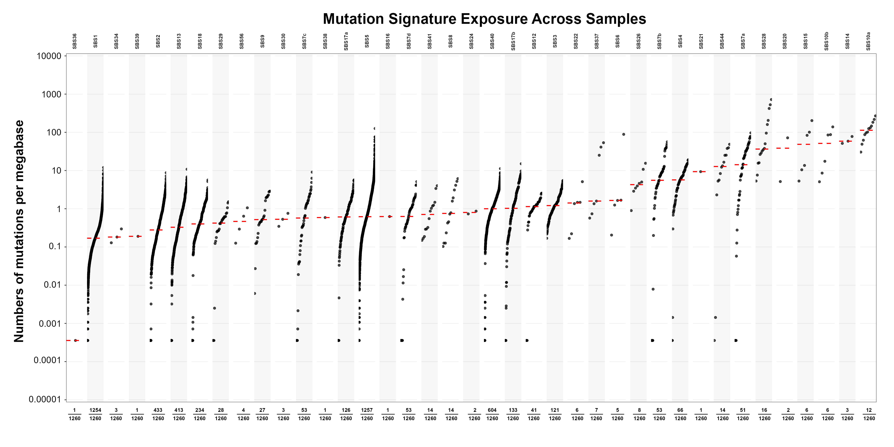
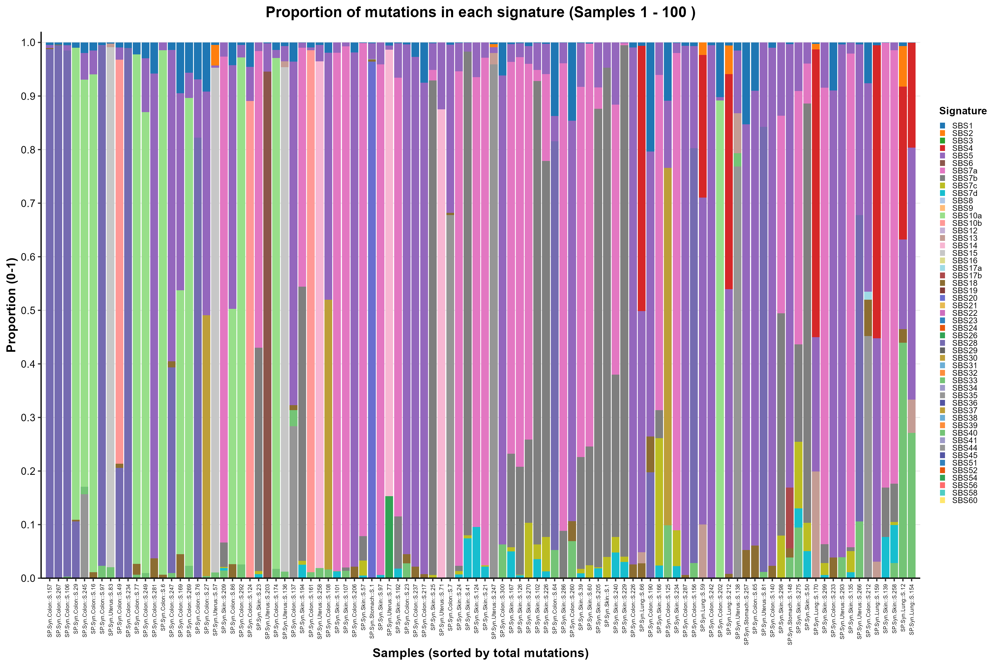
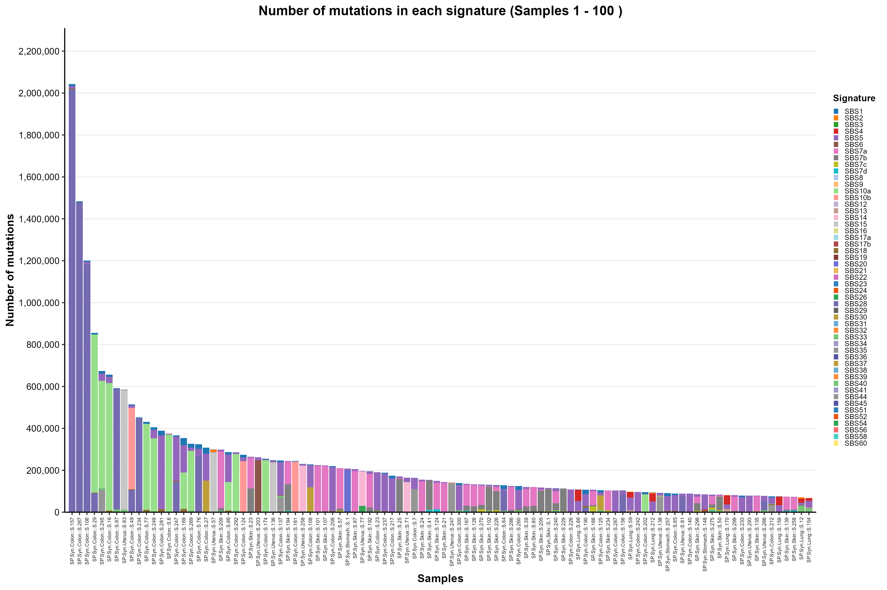

```{r setup, include=FALSE}
knitr::opts_chunk$set(
  echo = TRUE,
  warning = FALSE,
  message = FALSE
)
```

# Introduction

## Background

Mutational signatures reflect the biological processes that generate somatic mutations in genomes. These signatures may arise from DNA replication errors, defects in DNA repair pathways, or exposure to environmental mutagens. Identifying active mutational signatures can provide insight into disease etiology, cancer evolution, and the mutational processes operating in individual tumors.

Large-scale cancer sequencing projects have cataloged many mutational signatures across different cancer types. Computational methods are therefore widely used to assign known mutational signatures to observed mutation profiles and estimate their contributions in individual samples.

## Overview of AMuSA

AMuSA (Autoencoder-driven Mutational Signature Assignment) is a hybrid deep learning framework for assigning known mutational signatures to genomic samples. It combines autoencoder-based representation learning with supervised signature prediction to identify active mutational signatures from mutation count matrices.

AMuSA first extracts informative features from mutational profiles and predicts the signatures likely to be active in each sample. Signature exposures are then estimated using non-negative least squares (NNLS). Samples with suboptimal reconstruction are subsequently evaluated through a refinement procedure.

AMuSA supports single base substitution (SBS), doublet base substitution (DBS), and small insertion and deletion (ID) signatures. Given a mutation count matrix and a compatible reference signature matrix, the framework outputs the predicted active signatures and their estimated exposures for each sample.

AMuSA is designed for assignment of known signatures from a predefined reference set rather than de novo signature extraction.

# Quick Start

AMuSA requires:

- a mutation count matrix;
- a reference signature matrix compatible with the selected pretrained model;
- pretrained AMuSA models corresponding to the selected mutation type.

Example for SBS analysis:

```bash
python -m AMuSA.main \
  --base_model_dir models \
  --mutation_file data/example_catalog.csv \
  --signature_file data/ground.truth.syn.sigs.SBS96.csv \
  --type SBS \
  --output_dir result \
  --cosine_threshold 0.95 \
  --probability_threshold 0.05 \
  --min_contribution 0.05 \
  --min_improvement 0.04 \
  --max_active_signatures 7
```

## Pretrained Models

Pretrained models are provided separately for SBS, DBS, and ID analyses. The model directories are organized under the parent `models/` directory:

```text
models/
├── SBS_models/
├── DBS_models/
└── ID_models/
```

The appropriate pretrained model is selected according to the mutation type specified by `--type`. Therefore, `--base_model_dir` should point to the parent model directory, for example:

```bash
--base_model_dir models
```

The reference signature matrix must be compatible with the pretrained model used for the selected mutation type.

# Data Preprocessing

## Mutation Count Matrix

AMuSA requires a mutation count matrix as input. Each row corresponds to a mutation context and each column corresponds to a sample.

**Example count matrix:**

| Type | SP.Syn.Other::S.29 | SP.Syn.Kidney::S.187 | SP.Syn.Prostate::S.174 |
|---|---:|---:|---:|
| A[C>A]A | 11 | 114 | 94 |
| A[C>A]C | 8 | 69 | 58 |
| A[C>A]G | 1 | 10 | 18 |
| A[C>A]T | 6 | 75 | 52 |
| C[C>A]A | 4 | 81 | 54 |
| C[C>A]C | 8 | 93 | 74 |
| ... | ... | ... | ... |
| T[T>G]T | 12 | 126 | 101 |

The mutation-context labels should correspond to those used in the reference signature matrix supplied for the same mutation type.

## Mutation Context Format

The structure of the mutation count matrix depends on the mutation category used for analysis.

- **SBS (Single Base Substitutions):** The standard input format consists of 96 trinucleotide mutation contexts, defined by the substitution type and the immediate 5' and 3' flanking nucleotides.
- **DBS (Doublet Base Substitutions):** The mutation matrix contains 78 contexts representing dinucleotide substitutions classified according to established DBS definitions.
- **ID (Insertions and Deletions):** The mutation matrix contains 83 contexts representing indel events categorized by type, length, and sequence context.

# Signature Reference Preparation

## COSMIC Signature Database

AMuSA uses reference mutational signatures for signature assignment. Reference signatures for SBS, DBS, and ID analyses can be obtained from the COSMIC Mutational Signatures Database or from another reference set that is compatible with the corresponding pretrained AMuSA model.

## Reference Signature Matrix

The reference signature file should be provided as a matrix of mutation probabilities, where each row corresponds to a mutation context and each column corresponds to a mutational signature.

Each signature column represents a probability distribution across mutation contexts and should sum to approximately 1.

**Example signature matrix:**

| Type | SBS1 | SBS2 | SBS3 | ... |
|---|---:|---:|---:|---:|
| A[C>A]A | 0.000886157230877471 | 5.80016751463797e-07 | 0.0208083233293317 | ... |
| A[C>A]C | 0.00228040461219034 | 0.000148004274511452 | 0.0165066026410564 | ... |
| A[C>A]G | 0.000177031410683197 | 5.23015105199252e-05 | 0.00175070028011204 | ... |
| A[C>A]T | 0.00128022715070335 | 9.78028246433782e-05 | 0.0122048819527811 | ... |
| C[C>A]A | 0.000312055367983941 | 0.0002080060074215 | 0.0225090036014406 | ... |
| C[C>A]C | 0.00179031765606171 | 9.53027524387929e-05 | 0.0253101240496198 | ... |
| ... | ... | ... | ... | ... |
| T[T>G]T | 2.23039573911599e-16 | 2.23006440649012e-16 | 0.0105042016806723 | ... |

# Software Requirements

## System Requirements

- Python >= 3.10
- CUDA 12.4 (recommended for GPU acceleration)
- PyTorch >= 2.5.1

GPU acceleration is recommended for model training and large-scale analyses. CPU-only execution is supported but may be slower.

## Core Python Dependencies

```text
numpy==1.26.4
pandas==2.2.3
scikit-learn==1.5.2
matplotlib==3.10.0
seaborn==0.13.2
```

## Installation

Clone the AMuSA repository and enter the project directory:

```bash
git clone git@github.com:Yangying400/AMuSA.git
cd AMuSA
```

Install the listed Python dependencies:

```bash
pip install numpy==1.26.4 pandas==2.2.3 scikit-learn==1.5.2 matplotlib==3.10.0 seaborn==0.13.2
```

# Signature Assignment Analysis

AMuSA performs mutational signature assignment by combining signature prediction, NNLS-based exposure estimation, reconstruction assessment, and refinement of samples with suboptimal reconstruction.

First, the trained ensemble model predicts the probability that each mutational signature is active in a sample. Signature-specific decision thresholds are then used to determine the initial set of active signatures.

Next, exposures of the predicted active signatures are estimated using non-negative least squares (NNLS), and reconstruction quality is assessed using cosine similarity between the observed and reconstructed mutation profiles.

Samples with suboptimal reconstruction are further evaluated through the refinement procedure described below.

# Running AMuSA

## Optional: Training New AMuSA Models

Run this step only when a new model needs to be trained. If pretrained AMuSA models are available, this step can be skipped and the main AMuSA pipeline can be run directly.

```bash
python -m AMuSA.optimize_parameters \
  --train_mutation data/example_train_catalog.csv \
  --train_exposure data/example_train_exposure.csv \
  --test_mutation data/example_catalog.csv \
  --test_exposure data/example_exposure.csv \
  --type SBS \
  --signature_file data/ground.truth.syn.sigs.SBS96.csv \
  --output_dir result
```

### Training Arguments

**`--train_mutation`**  
Path to the training mutation catalog file.  
Example: `data/example_train_catalog.csv`

**`--train_exposure`**  
Path to the training exposure file containing the labels used for model training.  
Example: `data/example_train_exposure.csv`

**`--test_mutation`**  
Path to the testing mutation catalog file.  
Example: `data/example_catalog.csv`

**`--test_exposure`**  
Path to the corresponding testing exposure file.  
Example: `data/example_exposure.csv`

**`--type`**  
Mutation type used for model training.  
Example: `SBS`

**`--signature_file`**  
Path to the reference signature matrix corresponding to the selected mutation type.  
Example: `data/ground.truth.syn.sigs.SBS96.csv`

**`--output_dir`**  
Directory in which training and optimization outputs are saved.  
Example: `result/`

> The exact files produced by the model-training command depend on the implementation of `AMuSA.optimize_parameters`. The main pipeline described below can be used directly when pretrained models are available.

## Run the AMuSA Pipeline

### Bash Usage

Example for SBS analysis:

```bash
python -m AMuSA.main \
  --base_model_dir models \
  --mutation_file data/example_catalog.csv \
  --signature_file data/ground.truth.syn.sigs.SBS96.csv \
  --type SBS \
  --output_dir result \
  --cosine_threshold 0.95 \
  --probability_threshold 0.05 \
  --min_contribution 0.05 \
  --min_improvement 0.04 \
  --max_active_signatures 7
```

For ID analysis, the default minimum improvement used in the current workflow is `0.03`; for SBS and DBS it is `0.04`.

### Python Usage

AMuSA can also be run directly from Python or a Jupyter notebook:

```python
from AMuSA.main import run_pipeline

run_pipeline(
    base_model_dir="models",
    mutation_file="data/example_catalog.csv",
    signature_file="data/ground.truth.syn.sigs.SBS96.csv",
    model_type="SBS",
    output_dir="result",
    cosine_threshold=0.95,
    probability_threshold=0.05,
    min_contribution=0.05,
    min_improvement=0.04,
    max_active_signatures=7,
)
```

Note that the command-line option is `--type`, whereas the corresponding Python argument for `run_pipeline()` is `model_type`.

## Input Arguments

### Model and Input Settings

**`--base_model_dir`**  
Path to the parent directory containing the pretrained AMuSA models for SBS, DBS, and ID analyses.  
Example: `models/`

**`--mutation_file`**  
Path to the mutation count matrix used for mutational signature assignment.  
Example: `data/example_catalog.csv`

**`--type`**  
Mutation type used for the analysis. Supported values are `SBS`, `DBS`, and `ID`.  
Example: `SBS`

**`--signature_file`**  
Path to the reference mutational signature matrix corresponding to the selected mutation type and pretrained model.  
Example: `data/ground.truth.syn.sigs.SBS96.csv`

**`--output_dir`**  
Directory in which AMuSA output files will be saved.  
Example: `result/`

### Refinement Settings

**`--cosine_threshold`**  
Cosine similarity threshold used to identify samples requiring further refinement. Samples with reconstruction cosine similarity below this threshold are selected for refinement.  
Default: `0.95`

**`--probability_threshold`**  
Minimum predicted probability required for an unselected signature to enter the candidate pool during refinement.  
Default: `0.05`

**`--min_contribution`**  
Minimum contribution fraction required for a signature to be retained during refinement.  
Default: `0.05`

**`--min_improvement`**  
Minimum improvement in cosine similarity required to accept a refined assignment.  
Workflow setting: `0.04` for SBS, `0.04` for DBS, and `0.03` for ID.

**`--max_active_signatures`**  
Maximum number of active signatures allowed in the final assignment for each sample.  
Default: `7`

# Pipeline Overview

AMuSA performs mutational signature assignment through a multi-step pipeline.

**Step 1: Initial signature prediction.**  
An ensemble of pretrained autoencoder-based models and signature classifiers predicts the activation probability of each mutational signature for every sample. These probabilities are converted into binary activation states using signature-specific decision thresholds to obtain the initial set of active signatures.

**Step 2: Initial exposure estimation and reconstruction assessment.**  
The exposures of the predicted active signatures are estimated using non-negative least squares (NNLS). Reconstruction quality is then assessed by calculating cosine similarity between the observed and reconstructed mutation profiles.

**Steps 3-4: Refinement of low-cosine samples.**  
Samples with reconstruction cosine similarity below `0.95` are selected for further refinement. Additional candidate signatures are considered based on their predicted probabilities, and signature exposures are re-estimated using NNLS. A refined assignment is accepted only when the reconstruction cosine similarity improves by at least the predefined minimum threshold.

**Step 5: Final replacement and output.**  
Accepted refined assignments replace the corresponding initial results. Samples without sufficient improvement retain their initial assignments. The resulting predictions and exposure estimates are saved as the final AMuSA outputs.

# Intermediate Results

The AMuSA pipeline generates intermediate prediction and exposure information that is used internally during signature assignment and refinement.

## Signature Probabilities

For each sample, the ensemble model produces an activation probability for every candidate signature.

**Example:**

| Signature | SP.Syn.Other::S.295 | SP.Syn.Kidney::S.187 | SP.Syn.Prostate::S.174 |
|---|---:|---:|---:|
| SBS1 | 0.95252866 | 0.9790471 | 0.96011555 |
| SBS2 | 0.94629574 | 0.20303026 | 0.19648902 |
| SBS3 | 0.054253995 | 0.098799184 | 0.108573094 |
| SBS4 | 0.01777694 | 0.006597654 | 0.008848998 |
| SBS5 | 0.9346374 | 0.8638319 | 0.95538294 |
| ... | ... | ... | ... |
| SBS60 | 0.015175613 | 0.1035275 | 0.07222911 |

## Signature-specific Decision Thresholds

Signature-specific thresholds are used to convert predicted probabilities into binary activity predictions.

**Example:**

| Signature | Threshold |
|---|---:|
| SBS1 | 0.4 |
| SBS2 | 0.4 |
| SBS3 | 0.4 |
| SBS4 | 0.4 |
| SBS5 | 0.4 |
| ... | ... |
| SBS60 | 0.3619 |

## Initial Predictions

The thresholded predictions form a binary signature assignment matrix, where `1` indicates that a signature is assigned to a sample and `0` indicates that it is not assigned.

**Example:**

| Signature | SP.Syn.Other::S.295 | SP.Syn.Kidney::S.187 | SP.Syn.Prostate::S.174 |
|---|---:|---:|---:|
| SBS1 | 1 | 1 | 1 |
| SBS2 | 1 | 0 | 0 |
| SBS3 | 0 | 0 | 0 |
| SBS4 | 0 | 0 | 0 |
| SBS5 | 1 | 1 | 1 |
| ... | ... | ... | ... |
| SBS60 | 0 | 0 | 0 |

## Initial Exposure Estimates

Initial signature exposures are estimated in Step 2 using NNLS based on the predicted active signatures before refinement.

**Example:**

| Signature | SP.Syn.Other::S.295 | SP.Syn.Kidney::S.187 | SP.Syn.Prostate::S.174 |
|---|---:|---:|---:|
| SBS1 | 754 | 316 | 245 |
| SBS2 | 1242 | 0 | 0 |
| SBS3 | 0 | 0 | 0 |
| SBS4 | 0 | 0 | 0 |
| SBS5 | 624 | 596 | 3014 |
| ... | ... | ... | ... |
| SBS60 | 0 | 0 | 0 |

## Low-cosine Samples

To assess reconstruction quality, cosine similarity is calculated between the observed and reconstructed mutation catalogs for each sample. Samples with cosine similarity below the predefined threshold are selected for refinement. Their mutation catalogs are used as input to the refinement procedure.

## Refined Predictions and Exposures

For low-cosine samples, additional candidate signatures are considered based on predicted probabilities. Signature exposures are then re-estimated using NNLS. Refined results are accepted only when the reconstruction cosine similarity improves by at least the predefined minimum threshold.

# Final Output Files

After the AMuSA pipeline is completed, the final results are saved under:

```text
<output_dir>/
└── results/
    └── <mutation_type>/
        ├── <mutation_type>_replaced_predictions.csv
        ├── <mutation_type>_replaced_exposure_float.csv
        └── <mutation_type>_replaced_exposure.csv
```

For an SBS analysis, for example:

```text
<output_dir>/
└── results/
    └── SBS/
        ├── SBS_replaced_predictions.csv
        ├── SBS_replaced_exposure_float.csv
        └── SBS_replaced_exposure.csv
```

When low-cosine samples are processed, intermediate refinement files may additionally be written under the analysis output directory, including the `low_cosine_refinement/` directory.

## `<mutation_type>_replaced_predictions.csv`

Final binary signature assignment matrix after refinement. Each row represents a mutational signature and each column represents a sample. A value of `1` indicates that the signature is assigned, whereas `0` indicates that it is not assigned.

## `<mutation_type>_replaced_exposure_float.csv`

Final signature exposure matrix after refinement with exposure values retained as floating-point numbers.

## `<mutation_type>_replaced_exposure.csv`

Final signature exposure matrix after refinement with exposure values rounded to integer mutation counts.

For samples that do not meet the minimum improvement criterion during refinement, the initial prediction and exposure estimates are retained.

# Visualization and Interpretation

The following R examples illustrate several ways to visualize AMuSA exposure outputs. The examples assume a CSV file in which rows are signatures and columns are samples, matching the final AMuSA exposure matrix format.

## R Visualization Requirements

```r
install.packages(c("ggplot2", "dplyr", "tidyr", "scales"))
```

## Dot Plot of Signature Exposure

This plot displays the non-zero signature exposure values for each sample. The y-axis is log10-scaled to facilitate visualization across samples with different exposure ranges.

### R code

```r
library(ggplot2)
library(dplyr)
library(tidyr)
library(scales)

# Load AMuSA exposure matrix
exposure <- read.csv(
  "AMuSA/AMuSA_example_exposure.csv",
  header = TRUE,
  row.names = 1,
  check.names = FALSE
)

# Convert to long format
plot_data <- exposure %>%
  tibble::rownames_to_column("Signature") %>%
  pivot_longer(
    cols = -Signature,
    names_to = "Sample",
    values_to = "Exposure"
  ) %>%
  filter(!is.na(Exposure), Exposure > 0)

# Order samples by median non-zero exposure
sample_order <- plot_data %>%
  group_by(Sample) %>%
  summarise(median_exposure = median(Exposure), .groups = "drop") %>%
  arrange(median_exposure) %>%
  pull(Sample)

plot_data$Sample <- factor(plot_data$Sample, levels = sample_order)

p <- ggplot(plot_data, aes(x = Signature, y = Exposure)) +
  geom_point(size = 1.5, alpha = 0.7) +
  scale_y_log10(labels = comma) +
  facet_grid(. ~ Sample, scales = "free_x", space = "free_x") +
  labs(
    x = "Mutational signature",
    y = "Signature exposure",
    title = "Mutational Signature Exposure Across Samples"
  ) +
  theme_classic() +
  theme(
    axis.text.x = element_text(angle = 90, hjust = 1, vjust = 0.5, size = 7),
    strip.text = element_text(size = 8, face = "bold")
  )

print(p)
```

### Result

<p align="center">
  
</p>

## Proportional Stacked Bar Chart

This plot shows the relative contribution of each assigned mutational signature within each sample.

### R code

```r
library(ggplot2)
library(dplyr)
library(tidyr)
library(scales)

# Load AMuSA exposure matrix
exposure <- read.csv(
  "AMuSA/AMuSA_example_exposure.csv",
  header = TRUE,
  row.names = 1,
  check.names = FALSE
)

plot_data <- exposure %>%
  tibble::rownames_to_column("Signature") %>%
  pivot_longer(
    cols = -Signature,
    names_to = "Sample",
    values_to = "Exposure"
  ) %>%
  filter(!is.na(Exposure), Exposure > 0) %>%
  group_by(Sample) %>%
  mutate(Proportion = Exposure / sum(Exposure)) %>%
  ungroup()

p <- ggplot(plot_data, aes(x = Sample, y = Proportion, fill = Signature)) +
  geom_col(width = 0.9) +
  scale_y_continuous(labels = percent_format(accuracy = 1)) +
  labs(
    x = "Sample",
    y = "Relative contribution",
    title = "Mutational Signature Composition Across Samples"
  ) +
  theme_classic() +
  theme(
    axis.text.x = element_text(angle = 90, hjust = 1, vjust = 0.5, size = 7),
    legend.title = element_text(face = "bold")
  )

print(p)
```

### Result

<p align="center">
  
</p>

## Stacked Count Bar Plot

This plot shows the absolute mutation counts attributed to each signature. For large cohorts, samples are displayed in batches to keep the figure readable.

### R code

```r
library(ggplot2)
library(dplyr)
library(tidyr)
library(scales)

# Load AMuSA exposure matrix
exposure <- read.csv(
  "AMuSA/AMuSA_example_exposure.csv",
  header = TRUE,
  row.names = 1,
  check.names = FALSE
)

plot_data <- exposure %>%
  tibble::rownames_to_column("Signature") %>%
  pivot_longer(
    cols = -Signature,
    names_to = "Sample",
    values_to = "Count"
  ) %>%
  filter(!is.na(Count), Count > 0)

# Order samples by total assigned mutation count
sample_order <- plot_data %>%
  group_by(Sample) %>%
  summarise(Total = sum(Count), .groups = "drop") %>%
  arrange(desc(Total)) %>%
  pull(Sample)

batch_size <- 100
num_batches <- ceiling(length(sample_order) / batch_size)

for (batch in seq_len(num_batches)) {
  start_idx <- (batch - 1) * batch_size + 1
  end_idx <- min(batch * batch_size, length(sample_order))
  batch_samples <- sample_order[start_idx:end_idx]

  batch_data <- plot_data %>%
    filter(Sample %in% batch_samples) %>%
    mutate(Sample = factor(Sample, levels = batch_samples))

  p <- ggplot(batch_data, aes(x = Sample, y = Count, fill = Signature)) +
    geom_col(width = 0.9) +
    scale_y_continuous(labels = comma, expand = expansion(mult = c(0, 0.05))) +
    labs(
      x = "Sample",
      y = "Number of mutations",
      title = paste0(
        "Assigned Mutations by Signature (Samples ",
        start_idx, "-", end_idx, ")"
      )
    ) +
    theme_classic() +
    theme(
      axis.text.x = element_text(angle = 90, hjust = 1, vjust = 0.5, size = 7),
      legend.title = element_text(face = "bold")
    )

  print(p)
}
```

### Result

<p align="center">
  
</p>

# Interpretation Notes

AMuSA assigns known mutational signatures from a predefined reference set. The resulting assignments and exposure estimates are computational estimates and should be interpreted together with biological, experimental, and clinical context when such information is available.

High reconstruction cosine similarity indicates that the assigned signatures reproduce the observed mutation profile well, but it should not by itself be interpreted as independent biological validation of a specific mutational process.
