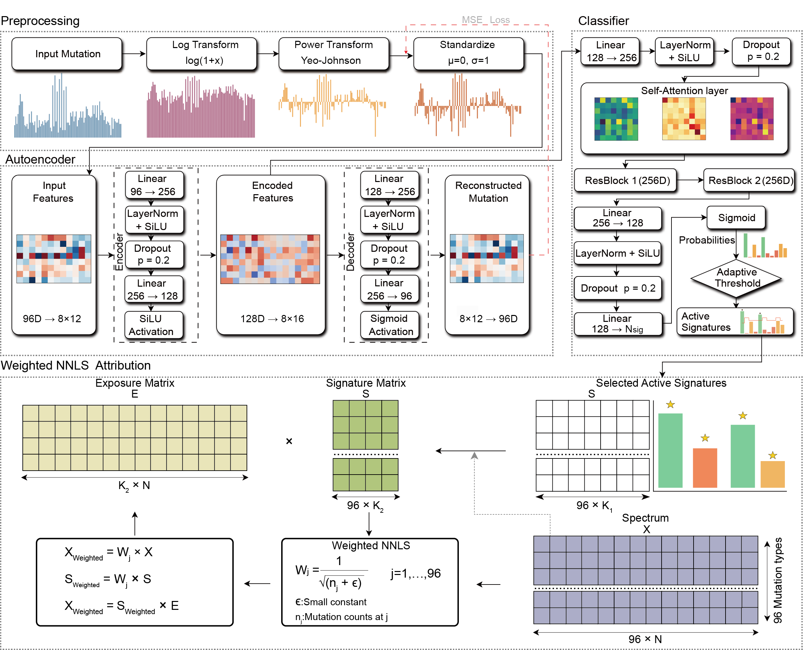

<p align="center">
  
</p>

# AMuSA

AMuSA (Autoencoder-driven Mutational Signature Assignment) is a hybrid deep learning framework for assigning known mutational signatures to genomic samples. It combines autoencoder-based representation learning with supervised signature prediction to identify active mutational signatures from mutation count matrices.

AMuSA first extracts informative features from mutational profiles and predicts the signatures likely to be active in each sample. Signature exposures are then estimated using non-negative least squares (NNLS), followed by an iterative refinement procedure for samples with suboptimal reconstruction.

AMuSA supports single base substitution (SBS), doublet base substitution (DBS), and small insertion and deletion (ID) signatures. Given a mutation count matrix and a reference signature matrix, the framework outputs the predicted active signatures and their estimated exposures for each sample.

## Installation

---

### Create a Conda Environment

We recommend using conda to manage dependencies and environments.

```bash
conda create -n amusa python=3.10
conda activate amusa
```

---

### Clone the Repository

```bash
git clone git@github.com:Yangying400/AMuSA.git
cd AMuSA
```

---

### System Requirements

- Python ≥ 3.10
- CUDA 12.4 
- PyTorch ≥ 2.5.1 


### Install Core Dependencies

```bash
pip install numpy==1.26.4 \
            pandas==2.2.3 \
            scikit-learn==1.5.2 \
            matplotlib==3.10.0 \
            seaborn==0.13.2
```

---

## Install AMuSA

From the project directory:

```bash
pip install .
```

For development mode installation:

```bash
pip install -e .
```

---


## Usage

AMuSA is a mutational signature assignment pipeline that integrates three core modules into a single unified workflow, without requiring step-by-step execution.

---

## modules  (Internal Pipeline)

Although AMuSA contains three modules, users only need to run one command:

- **(1) Autoencoder-based representation learning**  
  Extracts key information from mutation count matrices into a latent representation.
- **(2) Signature classification**  
  Estimates the probability of activation for each mutational signature.

- **(3)NNLS refinement (NNLS)**  
  Estimates mutational signature exposures using non-negative least squares (NNLS).

---

## Run AMuSA (Bash)

```bash
python -m AMuSA.main \
  --type SBS \
  --mutation_file data/example_catalog.csv \
  --signature_file data/ground.truth.syn.sigs.SBS96.csv \
  --output_dir result
```
---

### Run with custom parameters

```bash
python -m AMuSA.main \
  --type SBS \
  --mutation_file data/example_catalog.csv \
  --signature_file data/ground.truth.syn.sigs.SBS96.csv \
  --output_dir result \
  --cosine_threshold 0.95 \
  --probability_threshold 0.05 \
  --min_contribution 0.05 \
  --min_improvement 0.04 \
  --max_active_signatures 7
```
---

## Python (Jupyter Notebook)

```python
from AMuSA import run_pipeline

run_pipeline(
    model_type="SBS",
    mutation_file="data/example_catalog.csv",
    signature_file="data/ground.truth.syn.sigs.SBS96.csv",
    output_dir="result",
)
```
---

```markdown
### Run with custom parameters

```python
from AMuSA import run_pipeline

run_pipeline(
    model_type="SBS",
    mutation_file="data/example_catalog.csv",
    signature_file="data/ground.truth.syn.sigs.SBS96.csv",
    output_dir="result",
    cosine_threshold=0.95,
    probability_threshold=0.05,
    min_contribution=0.05,
    min_improvement=0.04,
    max_active_signatures=7,
)
```
## Main Parameters
| Parameter | Variable Type | Parameter Description |
|----------|--------------|----------------------|
| `base_model_dir` | String, optional | Path to the pretrained AMuSA model directory. If omitted, AMuSA automatically uses the models bundled with the installed package. |
| `--type` / `model_type` | String | Type of mutational signatures used in the analysis (e.g., SBS). Default: `SBS` |
| mutation_file | String | Path to the mutation catalog file for signature analysis. Default: `data/example_catalog.csv` |
| signature_file | String | Path to the reference or ground-truth signature file. Default: `data/ground.truth.syn.sigs.SBS96.csv` |
| output_dir | String | Path to the output directory where results will be saved. Default: `result/` |
| cosine_threshold | Float | Reconstruction cosine similarity threshold used to identify samples requiring refinement. Samples below this threshold enter the refinement step. Default: `0.95` |
| probability_threshold | Float | Minimum predicted probability required for an unselected signature to enter the candidate pool during refinement. Default: `0.02` |
| min_contribution | Float | Minimum contribution fraction required for a candidate signature to be retained during refinement. Default: `0.05` |
| min_improvement | Float |Minimum increase in cosine similarity required for a refined solution to replace the initial assignment. Default: `SBS: 0.04; DBS: 0.04; ID: 0.03` |
| max_active_signatures | Integer | Maximum number of active signatures allowed in the decomposition. Default: `7` |

Note: The reference signature file and pretrained model must correspond to the selected mutation type (SBS, DBS, or ID). The default min_improvement is 0.04 for SBS and DBS and 0.03 for ID.
### Workflow
<p align="center">
  
</p>
