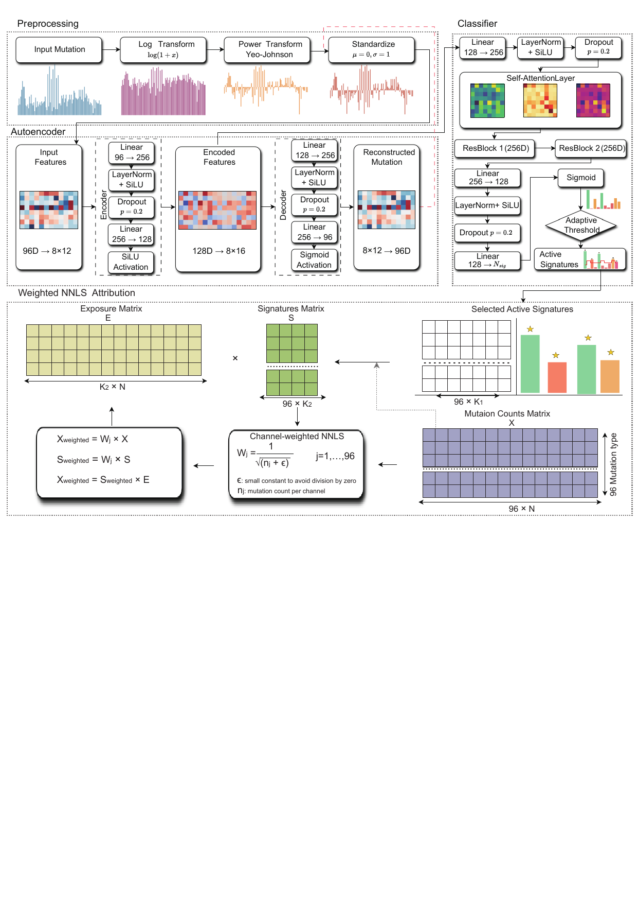

<p align="center">
  
</p>

# AMuSA

AMuSA (Autoencoder Mutational Signature Assignment) is a hybrid deep learning framework for mutational signature assignment. By integrating unsupervised autoencoder-based denoising with supervised classifier guidance, AMuSA overcomes limitations of conventional linear refitting approaches and improves the accuracy of signature identification and exposure estimation.

The framework incorporates a dynamic channel-weighting mechanism to reduce bias introduced by dominant signatures, enabling accurate and joint inference of single base substitution (SBS), insertion–deletion (ID), and doublet base substitution (DBS) signatures.

Given mutation count matrices derived from sequencing data, AMuSA predicts active mutational signatures and estimates their quantitative contributions across genomic samples.

## Installation

---

### Create a Conda Environment

We recommend using conda to manage dependencies and environments.

```bash
conda create -n amusa python=3.10
conda activate amusa
```

---

### Clone the Repository

```bash
git clone git@github.com:Yangying400/AMuSA.git
cd AMuSA
```

---

### System Requirements

- Python ≥ 3.10
- CUDA 12.4 
- PyTorch ≥ 2.5.1 


### Install Core Dependencies

```bash
pip install numpy==1.26.4 \
            pandas==2.2.3 \
            scikit-learn==1.5.2 \
            matplotlib==3.10.0 \
            seaborn==0.13.2
```

---

## Install AMuSA

From the project directory:

```bash
pip install .
```

For development mode installation:

```bash
pip install -e .
```

---


## Usage

AMuSA is an  mutational signature assignment pipeline. It integrates three internal modules, but runs as a single unified process without requiring step-by-step execution.

---

## modules  (Internal Pipeline)

Although AMuSA contains three modules, users only need to run one command:

- **(1) Autoencoder-based representation learning**  
  Learns a denoised latent representation from mutation count matrices.

- **(2) Signature classification**  
  Estimates the probability of activation for each mutational signature.

- **(3) Weighted NNLS refinement (WNNLS)**  
  Refines signature exposures using channel-aware weighting to reduce bias.

---

## Run AMuSA (bash)

```bash
python -m AMuSA.main \
  --base_model_dir models \
  --mutation_file data/example_catalog.csv \
  --sig_file data/ground.truth.syn.sigs.SBS96.csv\
  --type SBS \
  --output_dir result
```

---

## Python  (jupyter notebook)

```python
from AMuSA.main import run_pipeline

run_pipeline(
    base_model_dir="models",
    mutation_file="data/example_catalog.csv",
    sig_file ="data/ground.truth.syn.sigs.SBS96.csv",
    mutation_type="SBS",
    output_dir="result"
)

```
---
## Main Parameters
| Parameter | Variable Type | Parameter Description |
|----------|--------------|----------------------|
| base_model_dir | String | Path to the directory containing the pretrained AMuSA models. Default: `models/` |
| mutation_file | String | Path to the mutation catalog file for signature analysis. Default: `data/example_catalog.csv` |
| type | String | Type of mutational signatures used in the analysis (e.g., SBS). Default: `SBS` |
| signature_file | String | Path to the reference or ground-truth signature file. Default: `data/ground.truth.syn.sigs.SBS96.csv` |
| output_dir | String | Path to the output directory where results will be saved. Default: `result/` |
| cosine_threshold | Float | Threshold for identifying low-confidence samples based on cosine similarity. Default: `0.9` |
| filtering_threshold | Float | Threshold used during refinement to filter weak signature contributions. Default: `0.02` |
| refine_thresholds | Float | Threshold used during refinement step to control signature selection sensitivity. Default: `0.1` |
| max_active_signatures | Integer | Maximum number of active signatures allowed in the decomposition. Default: `7` |

### Workflow
<p align="center">
  
</p>
